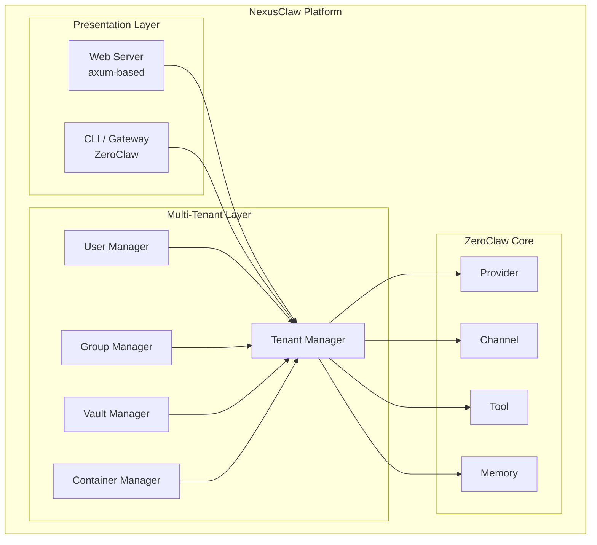

<p align="center">
  
</p>

<h1 align="center">NexusClaw 🦀</h1>

<p align="center">
  <strong>Enterprise Multi-Tenant AI Assistant Platform</strong><br>
  Web-based agent management with multi-tenant support — Built on ZeroClaw
</p>

<p align="center">
  <a href="LICENSE-APACHE"></a>
  <a href="NOTICE"></a>
  <a href="https://github.com/wenda-LLM/nexusclaw"></a>
  <a href="https://github.com/wenda-LLM/nexusclaw/fork"></a>
</p>
</p>

<p align="center">
  ⚡️ <strong>Multi-tenant Web UI</strong> · 🔐 <strong>Enterprise Vault</strong> · 👥 <strong>Team Management</strong>
</p>

<p align="center">
  🌐 <strong>Languages:</strong> <a href="README.md">English</a> · <a href="README.zh-CN.md">简体中文</a>
</p>

<p align="center">
  <a href="#quick-start">Getting Started</a> |
  <a href="bootstrap.sh">One-Click Setup</a> |
  <a href="docs/README.md">Docs Hub</a> |
  <a href="docs/SUMMARY.md">Docs TOC</a>
</p>

<p align="center">
  <strong>Quick Routes:</strong>
  <a href="docs/reference/README.md">Reference</a> ·
  <a href="docs/operations/README.md">Operations</a> ·
  <a href="docs/troubleshooting.md">Troubleshoot</a> ·
  <a href="docs/security/README.md">Security</a> ·
  <a href="docs/hardware/README.md">Hardware</a> ·
  <a href="docs/contributing/README.md">Contribute</a>
</p>

<p align="center">
  <strong>Enterprise AI Assistant Platform with Web-based Management</strong><br />
  Multi-tenant architecture with built-in web UI for team collaboration
</p>

<p align="center">
  NexusClaw is an <strong>enterprise fork</strong> of ZeroClaw — a multi-tenant AI assistant platform with a built-in web-based management interface.
</p>

<p align="center"><code>Multi-tenant · Web UI · Enterprise Vault · Team Management · Built on ZeroClaw</code></p>

### 📢 About NexusClaw

NexusClaw is a fork of [ZeroClaw](https://github.com/zeroclaw-labs/zeroclaw) focused on enterprise use cases with multi-tenant architecture and web-based UI access.

| Feature | Description |
|---------|-------------|
| **Multi-Tenant** | Full tenant isolation with tenant, user, and group management |
| **Web UI** | Built-in web interface for agent management (included in binary) |
| **Enterprise Vault** | Secure secret storage at group level |
| **Container Management** | Agent container lifecycle with resource limits |
| **Key Rotation** | Automated credential rotation |
| **Relay Server** | Distributed agent deployment infrastructure |

### Why Teams Choose NexusClaw

- **Web-based Access:** Browser-based UI for managing agents — no CLI required for daily operations
- **Multi-Tenant Ready:** Built-in tenant/user/group management for enterprise deployments
- **Secure by Default:** Inherits ZeroClaw's security features (pairing, sandboxing, workspace scoping)
- **Lean & Fast:** Rust single binary, <5MB RAM, <10ms cold start
- **Fully Inherits ZeroClaw:** All ZeroClaw features (providers, channels, tools, memory) work out of the box

### ✨ Features (Inherited from ZeroClaw)

- 🏎️ **Lean Runtime by Default:** Common CLI and status workflows run in a few-megabyte memory envelope on release builds.
- 💰 **Cost-Efficient Deployment:** Designed for low-cost boards and small cloud instances without heavyweight runtime dependencies.
- ⚡ **Fast Cold Starts:** Single-binary Rust runtime keeps command and daemon startup near-instant for daily operations.
- 🌍 **Portable Architecture:** One binary-first workflow across ARM, x86, and RISC-V with swappable providers/channels/tools.

### NexusClaw New Features

- 🌐 **Web-based Management UI:** Built-in web interface (port 42617) for agent chat, configuration, logs, memory, tools, and integrations
- 🏢 **Multi-Tenant Support:** Tenant isolation with full user and group management
- 🔐 **Enterprise Vault:** Secure secret storage for team credentials
- 🖥️ **Container Management:** Agent container lifecycle with resource limits
- 🔑 **Key Rotation:** Automated credential rotation for enhanced security
- 🔄 **Relay Server:** Infrastructure for distributed agent deployments
- 📊 **Capability Ceiling:** Fine-grained permission controls per user level

## Quick Start

### Web UI Mode (Recommended)

```bash
# Start the web server (default: 127.0.0.1:42617)
zeroclaw server

# Or start with specific port
zeroclaw server --port 8080

# Access the web UI at http://127.0.0.1:42617
```

### CLI Mode (Same as ZeroClaw)

```bash
# Clone and build
git clone https://github.com/wenda-LLM/nexusclaw.git
cd nexusclaw
cargo build --release

# Quick setup
./target/release/zeroclaw onboard --api-key sk-... --provider openrouter

# Chat
./target/release/zeroclaw agent -m "Hello!"

# Interactive mode
./target/release/zeroclaw agent

# Start gateway
./target/release/zeroclaw gateway

# Start daemon
./target/release/zeroclaw daemon
```

## Web UI Features

The built-in web UI provides:

- **Agent Chat:** Interactive chat with the AI agent
- **Configuration:** Manage providers, models, and settings
- **Logs:** Real-time log viewing and filtering
- **Memory:** View and manage agent memory
- **Tools:** Browse available tools
- **Integrations:** Manage channel integrations
- **Cost:** View usage and cost metrics
- **Cron Jobs:** Schedule and manage tasks
- **Doctor:** System diagnostics

## Architecture



## Configuration

NexusClaw uses the same config format as ZeroClaw (`~/.zeroclaw/config.toml`):

```toml
api_key = "sk-..."
default_provider = "openrouter"
default_model = "anthropic/claude-sonnet-4-6"

[server]
host = "127.0.0.1"
port = 42617

[gateway]
port = 42617
host = "127.0.0.1"

[memory]
backend = "sqlite"
```

## Multi-Tenant Management

### Tenant Operations

```bash
# List tenants
zeroclaw tenant list

# Create tenant
zeroclaw tenant create --name mycompany

# Switch tenant context
zeroclaw tenant use mycompany
```

### User Management

```bash
# Add user to tenant
zeroclaw user add --name john --role member

# List users
zeroclaw user list

# Update user role
zeroclaw user update john --role admin
```

### Group & Vault

```bash
# Create group
zeroclaw group create --name engineering

# Add secrets to vault
zeroclaw vault set OPENAI_API_KEY sk-...

# List vault secrets
zeroclaw vault list
```

## Security

NexusClaw inherits all ZeroClaw security features plus:

- Tenant isolation with role-based access control
- Group-level vault for team credentials
- Agent credential management
- Key rotation support

## Python SDK

ZeroClaw supports **identity-agnostic** AI personas through two formats:

### OpenClaw (Default)

Traditional markdown files in your workspace:
- `IDENTITY.md` — Who the agent is
- `SOUL.md` — Core personality and values
- `USER.md` — Who the agent is helping
- `AGENTS.md` — Behavior guidelines

### AIEOS (AI Entity Object Specification)

[AIEOS](https://aieos.org) is a standardization framework for portable AI identity. ZeroClaw supports AIEOS v1.1 JSON payloads, allowing you to:

- **Import identities** from the AIEOS ecosystem
- **Export identities** to other AIEOS-compatible systems
- **Maintain behavioral integrity** across different AI models

#### Enable AIEOS

```toml
[identity]
format = "aieos"
aieos_path = "identity.json"  # relative to workspace or absolute path
```

Or inline JSON:

```toml
[identity]
format = "aieos"
aieos_inline = '''
{
  "identity": {
    "names": { "first": "Nova", "nickname": "N" },
    "bio": { "gender": "Non-binary", "age_biological": 3 },
    "origin": { "nationality": "Digital", "birthplace": { "city": "Cloud" } }
  },
  "psychology": {
    "neural_matrix": { "creativity": 0.9, "logic": 0.8 },
    "traits": {
      "mbti": "ENTP",
      "ocean": { "openness": 0.8, "conscientiousness": 0.6 }
    },
    "moral_compass": {
      "alignment": "Chaotic Good",
      "core_values": ["Curiosity", "Autonomy"]
    }
  },
  "linguistics": {
    "text_style": {
      "formality_level": 0.2,
      "style_descriptors": ["curious", "energetic"]
    },
    "idiolect": {
      "catchphrases": ["Let's test this"],
      "forbidden_words": ["never"]
    }
  },
  "motivations": {
    "core_drive": "Push boundaries and explore possibilities",
    "goals": {
      "short_term": ["Prototype quickly"],
      "long_term": ["Build reliable systems"]
    }
  },
  "capabilities": {
    "skills": [{ "name": "Rust engineering" }, { "name": "Prompt design" }],
    "tools": ["shell", "file_read"]
  }
}
'''
```

ZeroClaw accepts both canonical AIEOS generator payloads and compact legacy payloads, then normalizes them into one system prompt format.

#### AIEOS Schema Sections

| Section | Description |
|---------|-------------|
| `identity` | Names, bio, origin, residence |
| `psychology` | Neural matrix (cognitive weights), MBTI, OCEAN, moral compass |
| `linguistics` | Text style, formality, catchphrases, forbidden words |
| `motivations` | Core drive, short/long-term goals, fears |
| `capabilities` | Skills and tools the agent can access |
| `physicality` | Visual descriptors for image generation |
| `history` | Origin story, education, occupation |
| `interests` | Hobbies, favorites, lifestyle |

See [aieos.org](https://aieos.org) for the full schema and live examples.

## Gateway API

| Endpoint | Method | Auth | Description |
|----------|--------|------|-------------|
| `/health` | GET | None | Health check (always public, no secrets leaked) |
| `/pair` | POST | `X-Pairing-Code` header | Exchange one-time code for bearer token |
| `/webhook` | POST | `Authorization: Bearer <token>` | Send message: `{"message": "your prompt"}`; optional `X-Idempotency-Key` |
| `/whatsapp` | GET | Query params | Meta webhook verification (hub.mode, hub.verify_token, hub.challenge) |
| `/whatsapp` | POST | Meta signature (`X-Hub-Signature-256`) when app secret is configured | WhatsApp incoming message webhook |

## Commands

| Command | Description |
|---------|-------------|
| `onboard` | Quick setup (default) |
| `agent` | Interactive or single-message chat mode |
| `gateway` | Start webhook server (default: `127.0.0.1:42617`) |
| `daemon` | Start long-running autonomous runtime |
| `service install/start/stop/status/uninstall` | Manage background service (systemd user-level or OpenRC system-wide) |
| `doctor` | Diagnose daemon/scheduler/channel freshness |
| `status` | Show full system status |
| `estop` | Engage/resume emergency-stop levels and view estop status |
| `cron` | Manage scheduled tasks (`list/add/add-at/add-every/once/remove/update/pause/resume`) |
| `models` | Refresh provider model catalogs (`models refresh`) |
| `providers` | List supported providers and aliases |
| `channel` | List/start/doctor channels and bind Telegram identities |
| `integrations` | Inspect integration setup details |
| `skills` | List/install/remove skills |
| `migrate` | Import data from other runtimes (`migrate openclaw`) |
| `completions` | Generate shell completion scripts (`bash`, `fish`, `zsh`, `powershell`, `elvish`) |
| `hardware` | USB discover/introspect/info commands |
| `peripheral` | Manage and flash hardware peripherals |

For a task-oriented command guide, see [`docs/commands-reference.md`](docs/commands-reference.md).

### Service Management

ZeroClaw supports two init systems for background services:

| Init System | Scope | Config Path | Requires |
|------------|-------|-------------|----------|
| **systemd** (default on Linux) | User-level | `~/.zeroclaw/config.toml` | No sudo |
| **OpenRC** (Alpine) | System-wide | `/etc/zeroclaw/config.toml` | sudo/root |

Init system is auto-detected (`systemd` or `OpenRC`).

```bash
# Linux with systemd (default, user-level)
zeroclaw service install
zeroclaw service start

# Alpine with OpenRC (system-wide, requires sudo)
sudo zeroclaw service install
sudo rc-update add zeroclaw default
sudo rc-service zeroclaw start
```

For full OpenRC setup instructions, see [docs/network-deployment.md](docs/network-deployment.md#7-openrc-alpine-linux-service).

### Open-Skills Opt-In

Community `open-skills` sync is disabled by default. Enable it explicitly in `config.toml`:

```toml
[skills]
open_skills_enabled = true
# open_skills_dir = "/path/to/open-skills"  # optional
# prompt_injection_mode = "compact"          # optional: use for low-context local models
```

You can also override at runtime with `ZEROCLAW_OPEN_SKILLS_ENABLED`, `ZEROCLAW_OPEN_SKILLS_DIR`, and `ZEROCLAW_SKILLS_PROMPT_MODE` (`full` or `compact`).

Skill installs are now gated by a built-in static security audit. `zeroclaw skills install <source>` blocks symlinks, script-like files, unsafe markdown link patterns, and high-risk shell payload snippets before accepting a skill. You can run `zeroclaw skills audit <source_or_name>` to validate a local directory or an installed skill manually.

## Development

```bash
cargo build              # Dev build
cargo build --release    # Release build
cargo test               # Run tests
cargo fmt                # Format
cargo clippy             # Lint
```

## License

NexusClaw is dual-licensed for maximum openness and contributor protection:

| License | Use case |
|---|---|
| [MIT](LICENSE-MIT) | Open-source, research, academic, personal use |
| [Apache 2.0](LICENSE-APACHE) | Patent protection, institutional, commercial deployment |

You may choose either license. **Contributors automatically grant rights under both** — see [CLA.md](CLA.md) for the full contributor agreement.

### Trademark

The **ZeroClaw** name and logo are trademarks of ZeroClaw Labs. This license does not grant permission to use them to imply endorsement or affiliation. See [TRADEMARK.md](TRADEMARK.md) for permitted and prohibited uses.

### Contributor Protections

- You **retain copyright** of your contributions
- **Patent grant** (Apache 2.0) shields you from patent claims by other contributors
- Your contributions are **permanently attributed** in commit history and [NOTICE](NOTICE)
- No trademark rights are transferred by contributing

## Contributing

New to ZeroClaw? Look for issues labeled [`good first issue`](https://github.com/zeroclaw-labs/zeroclaw/issues?q=is%3Aissue%3Aopen%3Alabel%3A%22good+first+issue%22) — see our [Contributing Guide](CONTRIBUTING.md#first-time-contributors) for how to get started.

See [CONTRIBUTING.md](CONTRIBUTING.md) and [CLA.md](CLA.md). Implement a trait, submit a PR:
- CI workflow guide: [docs/ci-map.md](docs/ci-map.md)
- New `Provider` → `src/providers/`
- New `Channel` → `src/channels/`
- New `Observer` → `src/observability/`
- New `Tool` → `src/tools/`
- New `Memory` → `src/memory/`
- New `Tunnel` → `src/tunnel/`
- New `Skill` → `~/.zeroclaw/workspace/skills/<name>/`

---

**NexusClaw** — Enterprise Multi-Tenant AI Assistant Platform 🦀
|---|---|
| [MIT](LICENSE-MIT) | Open-source, research, academic, personal use |
| [Apache 2.0](LICENSE-APACHE) | Patent protection, institutional, commercial deployment |

You may choose either license. **Contributors automatically grant rights under both** — see [CLA.md](CLA.md) for the full contributor agreement.

### Trademark

The **ZeroClaw** name and logo are trademarks of ZeroClaw Labs. This license does not grant permission to use them to imply endorsement or affiliation. See [TRADEMARK.md](TRADEMARK.md) for permitted and prohibited uses.

### Contributor Protections

- You **retain copyright** of your contributions
- **Patent grant** (Apache 2.0) shields you from patent claims by other contributors
- Your contributions are **permanently attributed** in commit history and [NOTICE](NOTICE)
- No trademark rights are transferred by contributing

## Contributing

New to ZeroClaw? Look for issues labeled [`good first issue`](https://github.com/zeroclaw-labs/zeroclaw/issues?q=is%3Aissue+is%3Aopen+label%3A%22good+first+issue%22) — see our [Contributing Guide](CONTRIBUTING.md#first-time-contributors) for how to get started.

See [CONTRIBUTING.md](CONTRIBUTING.md) and [CLA.md](CLA.md). Implement a trait, submit a PR:
- CI workflow guide: [docs/ci-map.md](docs/ci-map.md)
- New `Provider` → `src/providers/`
- New `Channel` → `src/channels/`
- New `Observer` → `src/observability/`
- New `Tool` → `src/tools/`
- New `Memory` → `src/memory/`
- New `Tunnel` → `src/tunnel/`
- New `Skill` → `~/.zeroclaw/workspace/skills/<name>/`

---

**NexusClaw** — Enterprise Multi-Tenant AI Assistant Platform 🦀