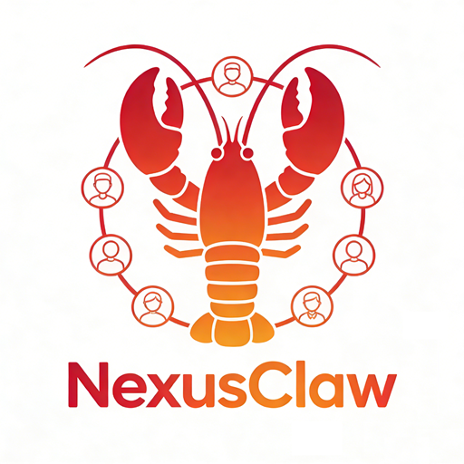
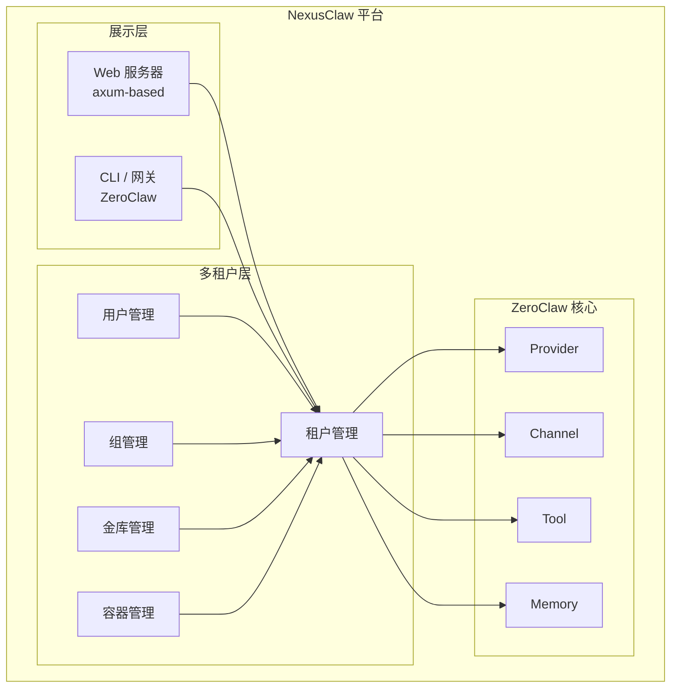

<p align="center">
  
</p>

<h1 align="center">NexusClaw 🦀</h1>

<p align="center">
  <strong>企业级多租户 AI 助手平台</strong><br>
  基于 Web UI 的多租户智能体管理平台 — 基于 ZeroClaw 构建
</p>

<p align="center">
  <a href="LICENSE"></a>
  <a href="NOTICE"></a>
  <a href="https://github.com/wenda-LLM/nexusclaw"></a>
  <a href="https://github.com/wenda-LLM/nexusclaw/fork"></a>
</p>
</p>

<p align="center">
  ⚡️ <strong>多租户 Web UI</strong> · 🔐 <strong>企业金库</strong> · 👥 <strong>团队管理</strong>
</p>

<p align="center">
  🌐 <strong>语言：</strong> <a href="README.md">English</a> · <a href="README.zh-CN.md">简体中文</a>
</p>

<p align="center">
  <a href="#快速开始">快速开始</a> |
  <a href="bootstrap.sh">一键部署</a> |
  <a href="docs/README.md">文档中心</a> |
  <a href="docs/SUMMARY.md">文档目录</a>
</p>

<p align="center">
  <strong>企业级 AI 助手平台 — 内置 Web 管理界面</strong><br />
  多租户架构，支持团队协作
</p>

<p align="center">
  NexusClaw 是 <strong>ZeroClaw 的企业级分支</strong> — 支持多租户架构和内置 Web 管理界面的 AI 助手平台。
</p>

<p align="center"><code>多租户 · Web UI · 企业金库 · 团队管理 · 基于 ZeroClaw</code></p>

### 📢 关于 NexusClaw

NexusClaw 是 [ZeroClaw](https://github.com/zeroclaw-labs/zeroclaw) 的企业级分支，专注于多租户架构和 Web UI 访问场景。

| 特性 | 说明 |
|---------|-------------|
| **多租户** | 完整的租户隔离，支持租户、用户和组管理 |
| **Web UI** | 内置 Web 界面进行智能体管理（二进制内置） |
| **企业金库** | 团队级别的安全密钥存储 |
| **容器管理** | 智能体容器生命周期和资源限制 |
| **密钥轮换** | 自动凭据轮换 |
| **中继服务器** | 分布式智能体部署基础设施 |

### 为什么选择 NexusClaw

- **Web 访问：** 基于浏览器的 UI 管理智能体 — 日常操作无需 CLI
- **多租户支持：** 内置租户/用户/组管理，适合企业部署
- **安全优先：** 继承 ZeroClaw 的安全特性（配对、沙箱、工作区作用域）
- **轻量快速：** Rust 单二进制，<5MB 内存，<10ms 冷启动
- **完全兼容 ZeroClaw：** 所有 ZeroClaw 特性（provider、channel、tool、memory）开箱即用

### ✨ 特性（继承自 ZeroClaw）

- 🏎️ **轻量运行时：** 常见 CLI 和 status 工作流在发布构建中仅占用几 MB 内存。
- 💰 **低成本部署：** 面向低价板卡和小规格云主机设计，不依赖厚重运行时。
- ⚡ **快速冷启动：** Rust 单二进制让常用命令与守护进程启动更接近"秒开"。
- 🌍 **跨架构可移植：** 同一套二进制优先流程覆盖 ARM/x86/RISC-V，保持 provider/channel/tool 可替换。

### NexusClaw 新增特性

- 🌐 **Web 管理界面：** 内置 Web 界面（端口 42617），支持智能体聊天、配置、日志、内存、工具和集成管理
- 🏢 **多租户支持：** 带完整用户和组管理的租户隔离
- 🔐 **企业金库：** 团队凭据的安全密钥存储
- 🖥️ **容器管理：** 智能体容器生命周期和资源限制
- 🔑 **密钥轮换：** 增强安全性的自动凭据轮换
- 🔄 **中继服务器：** 分布式智能体部署基础设施
- 📊 **能力上限：** 细粒度的用户级别权限控制

## 快速开始

### Web UI 模式（推荐）

```bash
# 启动 Web 服务器（默认：127.0.0.1:42617）
zeroclaw server

# 或指定端口
zeroclaw server --port 8080

# 访问 Web UI：http://127.0.0.1:42617
```

### CLI 模式（与 ZeroClaw 相同）

```bash
# 克隆并构建
git clone https://github.com/wenda-LLM/nexusclaw.git
cd nexusclaw
cargo build --release

# 快速配置
./target/release/zeroclaw onboard --api-key sk-... --provider openrouter

# 对话
./target/release/zeroclaw agent -m "你好！"

# 交互模式
./target/release/zeroclaw agent

# 启动网关
./target/release/zeroclaw gateway

# 启动守护进程
./target/release/zeroclaw daemon
```

## Web UI 功能

内置 Web UI 提供：

- **智能体聊天：** 与 AI 智能体交互式对话
- **配置：** 管理 provider、模型和设置
- **日志：** 实时日志查看和过滤
- **内存：** 查看和管理智能体内存
- **工具：** 浏览可用工具
- **集成：** 管理渠道集成
- **成本：** 查看使用情况和成本指标
- **定时任务：** 计划和管理任务
- **诊断：** 系统诊断

## 架构



## 配置

NexusClaw 使用与 ZeroClaw 相同的配置格式（`~/.zeroclaw/config.toml`）：

```toml
api_key = "sk-..."
default_provider = "openrouter"
default_model = "anthropic/claude-sonnet-4-6"

[server]
host = "127.0.0.1"
port = 42617

[gateway]
port = 42617
host = "127.0.0.1"

[memory]
backend = "sqlite"
```

## 多租户管理

### 租户操作

```bash
# 列出租户
zeroclaw tenant list

# 创建租户
zeroclaw tenant create --name mycompany

# 切换租户上下文
zeroclaw tenant use mycompany
```

### 用户管理

```bash
# 添加用户到租户
zeroclaw user add --name john --role member

# 列出用户
zeroclaw user list

# 更新用户角色
zeroclaw user update john --role admin
```

### 组和金库

```bash
# 创建组
zeroclaw group create --name engineering

# 添加密钥到金库
zeroclaw vault set OPENAI_API_KEY sk-...

# 列出金库密钥
zeroclaw vault list
```

## 安全

NexusClaw 继承所有 ZeroClaw 安全特性，同时提供：

- 基于角色的访问控制的租户隔离
- 团队凭据的组级金库
- 智能体凭据管理
- 密钥轮换支持

## 开发

```bash
cargo build              # 开发构建
cargo build --release    # 发布构建
cargo test               # 运行测试
cargo fmt                # 格式化
cargo clippy             # 代码检查
```

## 许可证

Apache-2.0（与 ZeroClaw 相同）

---

**NexusClaw** — 企业级多租户 AI 助手平台 🦀